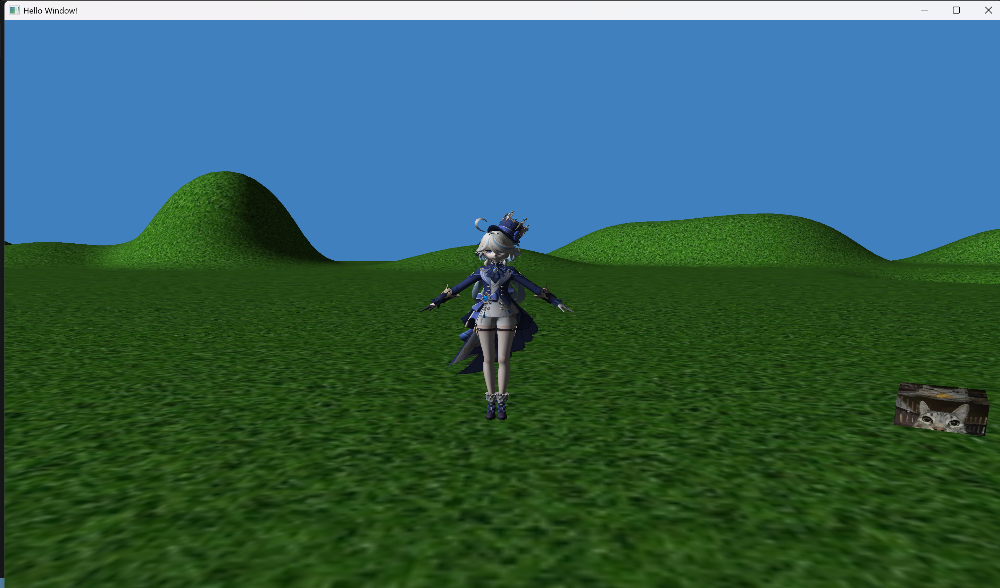

# OpenGL Assignment

This project is a 3D OpenGL application built with CMake, GLFW, GLAD, and GLM. It uses a simple component-system approach to manage objects, camera, physics, and rendering.

## Preview



## Features

- 3D rendering with the OpenGL core profile
- FPS-style camera with mouse look
- Camera movement with `W`, `A`, `S`, `D`
- Jump with `Space`
- Exit the application with `Esc`
- Render multiple objects and models from the `models/` folder

## Project Structure

- `src/` - main source code
- `src/components/` - entity components
- `src/systems/` - systems for motion, collision, camera, and rendering
- `src/factories/` - entity and mesh creation
- `src/view/` - shader and rendering utilities
- `src/shaders/` - vertex and fragment shader files
- `dependencies/` - third-party library headers
- `models/` - model and texture assets

## Requirements

- CMake 3.12 or newer
- A C++20 compiler
- OpenGL
- GLFW

`GLAD` and `GLM` are already included in this repository.

## Build Instructions

Run the following from the project root:

```bash
cmake -S . -B build
cmake --build build
```

If your generator or toolchain is different, adjust the CMake commands to match your environment.

## Run Instructions

After the build succeeds, run the generated executable named `hello_window` from the build output folder.

Example:

```bash
./build/hello_window
```

On Windows, the executable may be named `hello_window.exe`.

## Controls

- `W` - move forward
- `A` - move left
- `S` - move backward
- `D` - move right
- `Mouse` - change the camera direction
- `Space` - jump
- `Esc` - quit

## Notes

This repository is my learning project for getting familiar with and experimenting with OpenGL by following the instructions from the YouTube playlist below:

https://www.youtube.com/playlist?list=PLn3eTxaOtL2PHxN8EHf-ktAcN-sGETKfw

Some parts of this project and its documentation were created with the help of AI.